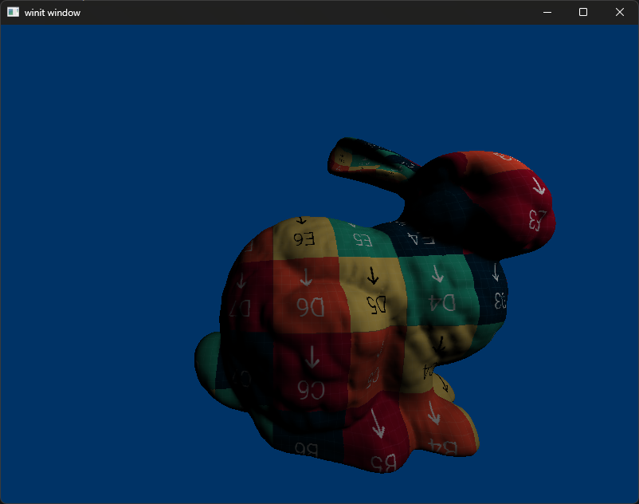

# D3D12 Renderer

## TODO

- [x] Load mesh
  - [x] Matrices
  - [x] Proper vertex buffers (staging heap, then copy to non-cpu visible heap)
  - [x] Index buffer
  - [x] Constant buffers
- [x] Depth buffer
- [ ] Upload Queue
  - [x] Basic usage
  - [ ] Ring buffer based upload queue
- [ ] Resources
  - [ ] Sub-allocate from a resource (for constant buffers)
- [x] Textures
- [ ] Precompiled shaders
- [ ] Shader reflection
  - [ ] Parse vertex format from DXIL?
- [ ] Basic Shadows

## Progress

2022-08-21

2022-09-19

Uploaded my first texture
